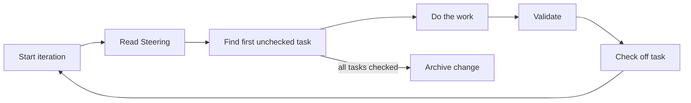

# Ralphy

An iterative AI task execution framework. Ralphy orchestrates multi-phase autonomous work using Claude or Codex engines, with built-in state management, progress tracking, and cost safeguards.

## How It Works

Ralphy runs a single continuous loop against an OpenSpec change — no phases, no phase transitions.



Each iteration reads the `## Steering` section of `proposal.md`, picks the first unchecked item from `tasks.md`, does the work, validates, and checks the item off. When all items are checked the loop archives the change automatically.

## Installation

### npm (global)

```bash
npm install -g ralphy
# or
bunx ralphy
```

Requires [Bun](https://bun.sh) as the runtime.

### Local (per-project)

```bash
bun install
make install            # Install to ./.ralph
make install ~           # Install to ~/.ralph
make install /path/to   # Install to /path/to/.ralph
```

This builds the CLI and MCP server, copies them to `.ralph/bin/`, sets up phase definitions and templates, configures `.mcp.json`, and adds a `ralph` script to `package.json`. The `.ralph/` directory is gitignored by default.

### Prerequisites

- [Bun](https://bun.sh)
- [Claude CLI](https://docs.anthropic.com/en/docs/claude-cli) (for the Claude engine)
- `jq` (for installation)

## Usage

### Create and Run a Task

```bash
ralph task --name fix-auth --prompt "Fix the JWT validation bug" --claude opus --max-iterations 10
```

The engine defaults to Claude Opus.

### Resume a Change

```bash
ralph task --name fix-auth
```

If the task already exists, it resumes from where it left off.

### Check Status

```bash
ralph list                    # Table of all tasks
ralph status --name fix-auth  # Detailed view of one task
```

## CLI Options

| Option                 | Description                                              |
| ---------------------- | -------------------------------------------------------- |
| `--name <name>`        | Task name (required for most commands)                   |
| `--prompt <text>`      | Task description                                         |
| `--prompt-file <path>` | Read prompt from a file                                  |
| `--claude [model]`     | Use Claude engine (haiku/sonnet/opus)                    |
| `--codex`              | Use Codex engine                                         |
| `--model <model>`      | Set model (haiku/sonnet/opus)                            |
| `--max-iterations <N>` | Stop after N iterations (0 = unlimited)                  |
| `--max-cost <N>`       | Stop when cost exceeds $N                                |
| `--max-runtime <N>`    | Stop after N minutes                                     |
| `--max-failures <N>`   | Stop after N consecutive identical failures (default: 5) |
| `--unlimited`          | Set max iterations to 0 (unlimited, default)             |
| `--delay <N>`          | Seconds to wait between iterations                       |
| `--log`                | Log raw JSON stream output                               |
| `--verbose`            | Verbose output                                           |

## OpenSpec Flow

There are no phases. One loop, one prompt, one `tasks.md` checklist.

Each change lives in `openspec/changes/<name>/`:

| File / Directory    | Purpose                                                   |
| ------------------- | --------------------------------------------------------- |
| `proposal.md`       | Description, goals, and the `## Steering` section         |
| `design.md`         | Technical design and architecture decisions               |
| `tasks.md`          | Checklist driving iteration — one unchecked item per loop |
| `specs/`            | Detailed specifications for individual tasks              |
| `.ralph-state.json` | Loop state (iteration count, status, cost, history)       |
| `STOP`              | Create this file to signal the loop to stop               |

Steering is delivered by editing the `## Steering` section of `proposal.md`. The agent reads it at the start of every iteration.

## MCP Server

Ralphy includes an MCP server that exposes task management tools to Claude agents. It's automatically configured during installation. Available tools:

- `ralph_list_changes` — List changes with status
- `ralph_get_change` — Get change details
- `ralph_create_change` — Create and optionally start a change
- `ralph_append_steering` — Append a steering message to `proposal.md`
- `ralph_stop` — Stop a running change

## Project Structure

```
ralphy/
├── apps/
│   ├── cli/          # CLI application
│   └── mcp/          # MCP server
├── packages/
│   ├── core/         # State management and loop
│   ├── context/      # Storage abstraction
│   ├── content/      # Base prompt and task templates
│   ├── engine/       # Claude/Codex engine spawning
│   ├── openspec/     # ChangeStore interface and OpenSpec adapter
│   ├── output/       # Terminal formatting
│   └── types/        # Zod schemas and types
└── Makefile
```

## Development

```bash
bun install
bunx nx run-many -t lint,typecheck,test,build   # Run checks
bunx nx run cli:build                            # Build CLI only
```
